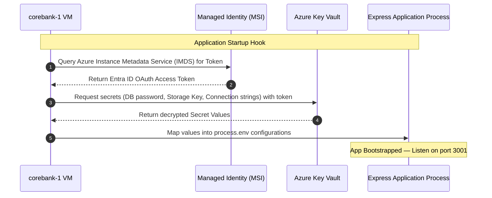
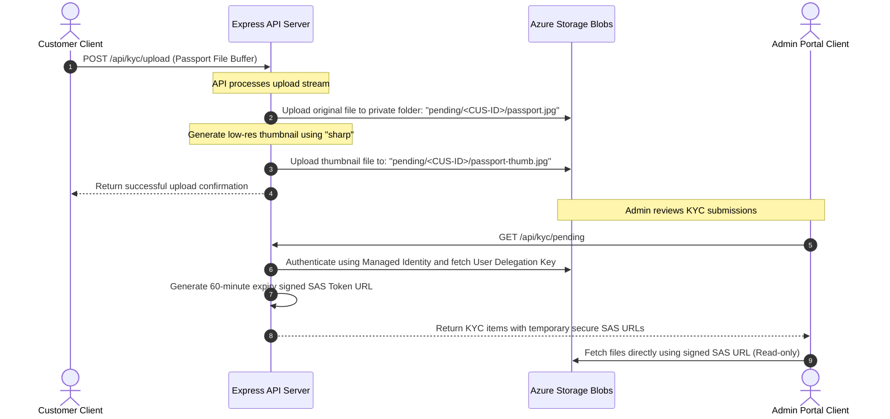
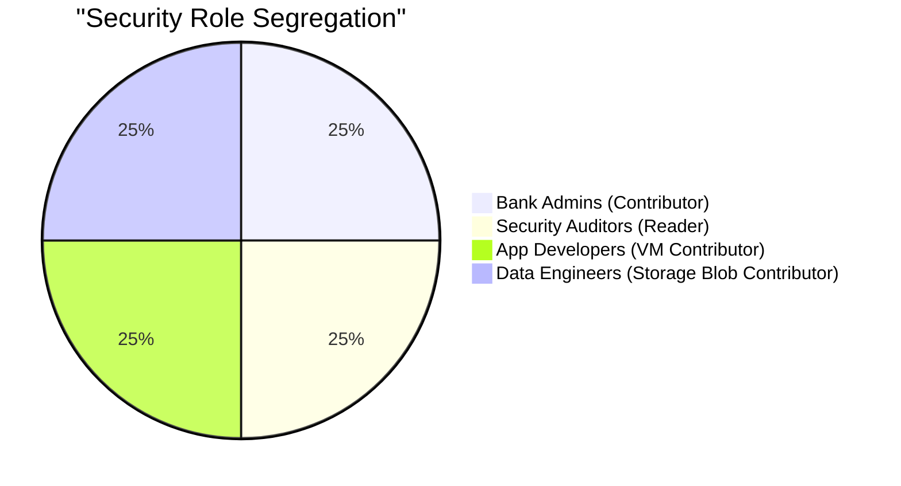

# 🏦 Detailed Full-Stack Banking System Architecture

This document provides a comprehensive technical breakdown of the **Azure Banking System Architecture**. It outlines the interactions between the **React Frontend Portal**, the **Express.js API Backend**, the **AML Rules Engine**, and the underlying **Azure Cloud Infrastructure** configured via Terraform.

---

## 1. High-Level Architectural Topology

The architecture leverages a hybrid client-cloud design combining highly available regional cloud networks, secure backend computation, serverless event channels, and strict regulatory compliance controls.

```mermaid
flowchart TB
    %% --- Custom Styles ---
    classDef client fill:#1e293b,stroke:#38bdf8,stroke-width:2px,color:#f8fafc,rx:8,ry:8
    classDef firewall fill:#b91c1c,stroke:#ef4444,stroke-width:2px,color:#ffffff,rx:5,ry:5
    classDef vnet fill:#e0f2fe,stroke:#0284c7,stroke-width:2px,color:#0f172a,rx:5,ry:5
    classDef subnet fill:#f0f9ff,stroke:#7dd3fc,stroke-width:1px,color:#0f172a,stroke-dasharray: 3 3,rx:5,ry:5
    classDef vm fill:#0369a1,stroke:#0284c7,stroke-width:2px,color:#ffffff,rx:10,ry:10
    classDef storage fill:#581c87,stroke:#7e22ce,stroke-width:2px,color:#ffffff,rx:10,ry:10
    classDef db fill:#0f766e,stroke:#0d9488,stroke-width:2px,color:#ffffff,rx:10,ry:10
    classDef security fill:#450a0a,stroke:#f87171,stroke-width:2px,color:#f8fafc,rx:8,ry:8

    subgraph ClientSpace["💻 Client Browser Layer"]
        direction LR
        Portal["🌐 React Web App<br/><small>Hosted on Storage $web</small>"]:::client
        MSAL["🔑 MSAL Client Auth<br/><small>AAD/Entra Login</small>"]:::client
    end

    subgraph VNetPrimary["🌐 Virtual Network 1 — East Asia (10.0.0.0/16)"]
        direction TB
        
        subgraph InfraSubnets["Infrastructure Segments"]
            direction LR
            BastionSub["🏰 AzureBastionSubnet"]:::subnet
            FirewallSub["🔥 AzureFirewallSubnet"]:::subnet
        end

        subgraph PrivateWorkloads["Private Enterprise Segments"]
            direction TB
            
            subgraph CoreBankSub["🏦 corebank Subnet (10.0.4.x)"]
                API["🚀 corebank-1 VM (10.0.4.4)<br/><small>Node.js Express API</small>"]:::vm
            end

            subgraph DatabaseSub["🗄️ database Subnet (10.0.6.x)"]
                DB["💾 database-1 VM (10.0.6.4)<br/><small>Microsoft SQL Server</small>"]:::vm
            end

            subgraph MgmtSub["⚙️ management Subnet (10.0.5.x)"]
                MGMT["💻 management-1 VM (10.0.5.4)<br/><small>Admin Operations</small>"]:::vm
            end
        end
    end

    subgraph ExternalServices["☁️ Azure Platform Services"]
        direction LR
        KeyVault["🔐 Azure Key Vault<br/><small>Managed Identity Auth</small>"]:::security
        SignalR["📯 Azure SignalR Service<br/><small>Real-time broads (Serverless)</small>"]:::storage
        Sentinel["🔎 Sentinel / Log Analytics<br/><small>DCE Log Ingestion (SIEM)</small>"]:::security
        StorageAcc["📦 Storage (mohdggulmaanbankr1)<br/><small>Static Web, KYC Containers</small>"]:::storage
    end

    %% Routing
    Portal -->|"1. MSAL login"| MSAL
    Portal -->|"2. HTTPS Web Requests (Port 3001)"| API
    API -->|"Startup: Load secrets"| KeyVault
    API -->|"Store Tx / Audit Logs"| DB
    API -->|"Upload KYC & Sign SAS Token"| StorageAcc
    API -->|"Trigger Real-time Alerts"| SignalR
    SignalR -.->|"Serverless Push Notifications"| Portal
    API -->|"Data Ingestion (DCE/DCR)"| Sentinel
    
    class VNetPrimary vnet
    class CoreBankSub,DatabaseSub,MgmtSub subnet
```

---

## 2. Dynamic End-to-End System Flows

### 2.1 Bootstrapping & Secret Loading Lifecycle
When the backend Express API starts up on `corebank-1` VM, it performs a secure, passwordless handshake to retrieve credentials:

### 2.2 KYC Secure Upload and Document Access Lifecycle
Customer KYC verification requires strict privacy. Documents must never be public. The architecture handles this securely:

---

## 3. Core Architectural Modules & Code Design

### 3.1 Network Topology & Isolation (Terraform)
The network architecture is divided into two primary regional Virtual Networks:
* **Virtual Network 1 (East Asia / Primary)**: `10.0.0.0/16`
* **Virtual Network 2 (Southeast Asia / DR)**: `10.1.0.0/16`

#### Micro-segmentation Subnets:
Traffic segmentation is enforced via specialized subnet groups configured with custom Network Security Groups:
1. **Core Workload Subnets**: `accounts`, `payments`, `customer` (Subnets for base banking traffic).
2. **Enterprise Subnets**:
   * `corebank-subnet` (`10.0.4.0/24`): Holds `corebank-1` running the Express API backend.
   * `management-subnet` (`10.0.5.0/24`): Holds system management interfaces.
   * `database-subnet` (`10.0.6.0/24`): Holds SQL Server VM instance.
3. **Infrastructure Routing boundaries**:
   * `AzureBastionSubnet` (`10.0.99.0/26`): Provides secure tunnel endpoints.
   * `AzureFirewallSubnet` (`10.0.98.0/24`): Dedicated segment for deep network packet routing and analysis.

#### Network Security Groups (NSGs):
Enforce **"Deny-By-Default"** inbound filters.
* All incoming traffic from the `Internet` tag is blocked on VMs.
* Remote management is strictly confined to Azure Bastion RDP/SSH tunnels.
* Global VNet Peering maps routing internally across Microsoft’s fiber backbone, bypassing public routing tables entirely.

---

### 3.2 Compute & API Logic (Node.js/Express Backend)
The backend service operates on a burstable `Standard_B2ats_v2` instance (perfect for stay-within-quota academic workloads) using standard Node.js Express.

* **API Entrypoint (`src/server.js`)**: Leverages `helmet` for HTTP header hardening, `cors` for restricted resource sharing pointing to the Static Website URL, and `express-rate-limit` to prevent denial-of-service attempts.
* **Secrets Management (`src/config/secrets.js`)**: Interfaces with `@azure/keyvault-secrets` using `@azure/identity`'s `DefaultAzureCredential`. Merges decrypted parameters into `process.env` dynamically, preserving a unified local `.env` development fallback experience.

---

### 3.3 Anti-Money Laundering (AML) Rules Engine (`src/services/AmlService.js`)
Pipes all system transactions through a sequential fraud analysis engine.

| Rule ID | Objective | Severity | Description / Trigger Pattern |
| :--- | :--- | :--- | :--- |
| **LARGE_CASH** | Large Cash Check | **High** | Single debit/withdrawal transactions exceeding `$10,000`. |
| **STRUCTURING** | Reporting Threshold Evasion | **Critical** | Triggers if the cumulative outflow within the last 24 hours totals between `$8,000` and `$10,000` (designed to identify users trying to avoid the $10k reporting limit). |
| **HIGH_VELOCITY** | Transaction Spams | **Medium** | Flags accounts processing greater than `5` transactions in a rolling 1-hour window. |
| **GEO_ANOMALY** | Location Anomalies | **Medium** | Compares the current transaction country against the location of the previous transaction. |

#### Flag Persistence & Escalation:
* Flags are logged directly to the `aml_flags` SQL table.
* **Automatic Freezing**: If a transaction triggers a **Critical** flag or matches **2+ flags** concurrently, the engine immediately updates the customer's state to `Flagged`, preventing further transactions until manually resolved.
* **Alert Broadcaster**: Immediately triggers an event pushed through Azure SignalR.

---

### 3.4 Real-Time SignalR Event Broadcaster (`src/services/signalr.js`)
Configured to use **Azure SignalR Service** in Serverless mode.
* **Negotiation Endpoint (`/api/signalr/negotiate`)**: Acts as a broker, parsing the connection string and returning the secure admin hub client URL.
* **Real-time Broadcaster (`broadcast(event, data)`)**: Pushes AML Alerts and system alerts immediately to connected admin portal browsers without client-side polling.

---

### 3.5 SIEM Audit Log Ingestion (`src/services/SentinelService.js`)
Ensures compliance and auditing by routing application operational logs directly into security analysis pipelines.
* **Batch Ingestion**: Logs are compiled into batches of up to 25 events and flushed every 10 seconds.
* **Data CollectionEndpoint (DCE)**: Utilizes Azure Monitor's Ingestion API to securely stream application events.
* **Log Analytics Custom Table**: Records are routed to `Custom-BankingAuditLogs_CL`.
* **Microsoft Sentinel Analytics**: Scheduled SIEM rules audit this table for:
  * Failed login spams.
  * System Administrator access logs during off-business hours.
  * Rapid customer freezes or modifications.

---

## 4. Identity, Governance, & Access Control (RBAC)

Identity management leverages Microsoft Entra ID groups and variables to execute strict role segregation:

### 🏢 Microsoft Entra ID Mappings & Personnel

#### 🛡️ Information Technology Department (Bank Administrators)
* **Assigned Role**: `Contributor` (scoped at the banking Resource Group).
* **Scope**: Full infrastructure provisioning except global RBAC role manipulation.
* **Personnel**: 
  * **Gulmaan** – Head of IT Infrastructure
  * **Priya** – Cloud Infrastructure Engineer

#### 🔎 Risk & Compliance (Security Auditors)
* **Assigned Role**: `Reader`.
* **Scope**: Full visibility into Azure policies, system metrics, and audit logs. Blocked from making modifications or viewing databases/Key Vault data plane secrets.
* **Personnel**:
  * **Rahul** – Chief Information Security Officer (CISO)
  * **Deepa** – Compliance Analyst

#### 💻 Application Engineering (Application Developers)
* **Assigned Role**: `Virtual Machine Contributor`.
* **Scope**: Lifecycle operations of workload virtual machines (restart, start, stop, deploy). Scoped away from network security rules and database layers.
* **Personnel**:
  * **Kavya** – Senior Software Engineer
  * **Rohan** – DevOps Engineer

#### 💾 Data & Analytics (Data Engineers)
* **Assigned Role**: `Storage Blob Data Contributor`.
* **Scope**: Full read/write data plane access exclusively within storage accounts and diagnostic containers. No compute access.
* **Personnel**:
  * **Ananya** – Senior Data Engineer
  * **Vikram** – Analytics Engineer
