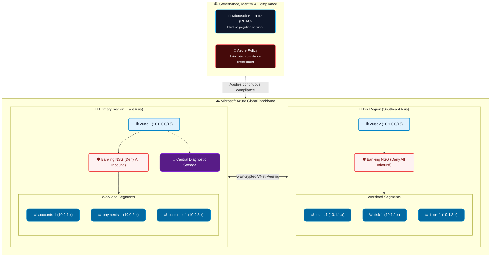
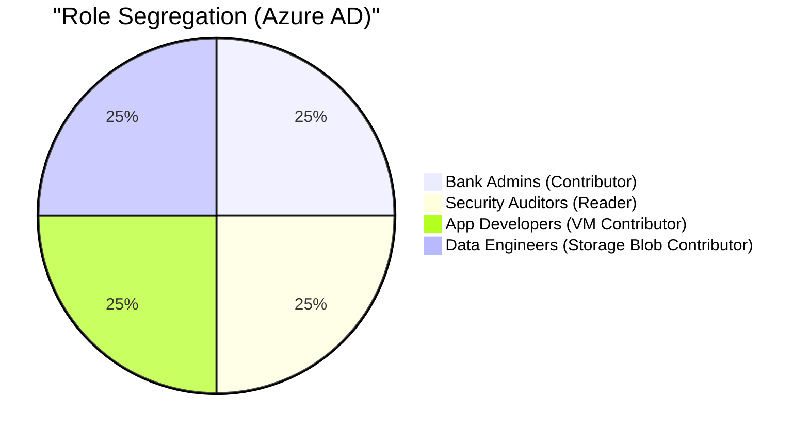

# 🏦 Detailed Banking System Architecture

This document provides an in-depth technical overview of the Azure Banking System Infrastructure. It breaks down the network topology, security controls, governance policies, and identity management strategies implemented via Terraform.

---

## 1. High-Level Topology

The infrastructure employs a **Multi-Region Active-Passive / Disaster Recovery** architecture utilizing two primary Azure regions. The design guarantees high availability and regional failover capabilities for critical banking workloads.

---

## 2. Network Architecture

### 2.1 Virtual Networks (VNets)
The system utilizes two isolated Virtual Networks to prevent lateral movement and contain potential breaches.
- **VNet 1 (East Asia)**: `10.0.0.0/16`
- **VNet 2 (Southeast Asia)**: `10.1.0.0/16`

### 2.2 Global VNet Peering
Connectivity between the East Asia and Southeast Asia regions is established exclusively through **Global VNet Peering**. 
- Traffic never transverses the public internet.
- Routing is handled internally via Microsoft's private, encrypted global backbone.

### 2.3 Micro-segmentation
Within each VNet, subnets (`/24`) isolate application domains (e.g., accounts, payments, risk). Network Security Groups (NSGs) act as virtual firewalls at the subnet level, strictly dropping all inbound internet traffic. 

---

## 3. Compute Infrastructure

The compute layer comprises customized Windows Server Virtual Machines tailored for specific banking operations.

- **VM SKU Strategy**: Uses `Standard_B2ats_v2` (Burstable) instances to maintain cost-efficiency while remaining within Azure's academic/student subscription vCPU quota limits.
- **Zero Public IPs**: Virtual Machines are explicitly barred from having Public IP configurations. Access is restricted to internal routing, Bastion hosts, or VPN gateways.
- **Identity Integration**: VMs are audited to ensure they utilize **SystemAssigned Managed Identities**, removing the need to manage static credentials or service principals manually.

---

## 4. Governance & Compliance (Azure Policy)

To satisfy financial regulatory requirements, the environment uses Azure Policy to enforce rules before resources are created, and continuously audit existing resources.

| Policy Objective | Azure Policy Rule | Effect |
| :--- | :--- | :--- |
| **Data Sovereignty** | `banking-allowed-locations` | **Deny**: Rejects any deployment outside `eastasia` or `southeastasia`. |
| **Attack Surface Reduction** | `banking-deny-public-ip` | **Deny**: Blocks the creation of public IP addresses on network interfaces. |
| **Financial Accountability** | `banking-require-mandatory-tags` | **Deny**: Requires `Owner`, `Environment`, and `CostCenter` tags on all deployments. |
| **Data Encryption in Transit** | Built-in Secure Transfer | **Deny**: Forces all Storage Account traffic over HTTPS. |
| **Zero-Trust Identity** | `banking-audit-vm-managed-identity` | **Audit**: Flags any VM not utilizing a System-Assigned Managed Identity. |

---

## 5. Identity & Access Management (RBAC)

The architecture leverages Microsoft Entra ID (formerly Azure Active Directory) to implement **Least Privilege Access**. Access is granted via Group memberships rather than assigning permissions to individual users. The organization is divided into 4 key departments, each with dedicated personnel:

### 🏢 Departmental Structure & Assigned Personnel

#### 🛡️ Information Technology (Bank Administrators)
Granted `Contributor` rights at the Resource Group level. Can modify infrastructure but cannot alter global RBAC definitions.
- **Gulmaan** – Head of IT Infrastructure
- **Priya** – Cloud Infrastructure Engineer

#### 🔎 Risk & Compliance (Security Auditors)
Granted `Reader` rights. Can view metrics, logs, and policies, but cannot execute changes or view data plane secrets.
- **Rahul** – Chief Information Security Officer (CISO)
- **Deepa** – Compliance Analyst

#### 💻 Application Engineering (Application Developers)
Granted `Virtual Machine Contributor` rights. Restricted to managing compute lifecycle (start, stop, restart, deploy code).
- **Kavya** – Senior Software Engineer
- **Rohan** – DevOps Engineer

#### 💾 Data & Analytics (Data Engineers)
Granted `Storage Blob Data Contributor` rights. Specifically scoped to manage financial data lakes and diagnostic storage, lacking compute access.
- **Ananya** – Senior Data Engineer
- **Vikram** – Analytics Engineer

---

## 6. Observability & Storage

A centralized **Azure Storage Account** is provisioned to act as a secure sink for diagnostics, flow logs, and system metrics. 
- **Encryption**: Data is encrypted at rest using Microsoft-managed keys.
- **Transit**: Secure transfer (HTTPS) is enforced via Azure Policy.
- **Access**: Access is heavily restricted, accessible only to Data Engineers and Bank Administrators.
