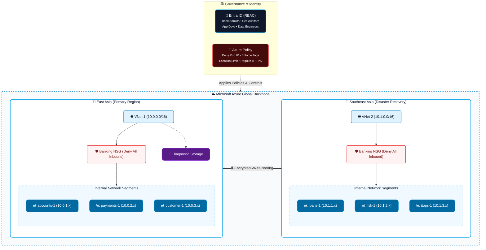

# 🏦 Azure Banking System Infrastructure

<div align="center">
  
  
  
  
  
</div>

<br>

A highly secure, multi-region, and modular cloud infrastructure deployed on Microsoft Azure using Terraform. Designed specifically for banking and financial applications where security, high availability, compliance, and strict access controls are paramount.

---

## 🏗️ Architecture Overview

This project provisions a production-grade infrastructure distributed across two Azure regions (`East Asia` and `Southeast Asia`), leveraging a Hub-and-Spoke-like isolated virtual network design. 



### Key Design Principles
- **Multi-Region Redundancy**: Workloads are distributed across two distinct geographical regions to ensure high availability.
- **VNet Peering**: Secure, backbone network connectivity is established between the two regional Virtual Networks.
- **Zero Public IPs**: Virtual machines are entirely isolated from the public internet to prevent external attack vectors.
- **Granular NSG Policies**: Strict Network Security Groups control internal traffic flow, permitting only essential protocols via secure bastions/jump-boxes.
- **Resource Optimization**: Architected to operate efficiently within strict Azure vCPU quota constraints utilizing `Standard_B2ats_v2` burstable instances.

---

## ✨ Features

- **Modular Architecture**: Built using highly reusable Terraform modules (`vnet`, `subnet`, `nsg`, `vm`, `storage`).
- **Identity & Access Management (RBAC)**: Enforces least privilege using Azure Active Directory, establishing custom roles for *Bank Administrators*, *Security Auditors*, *Application Developers*, and *Data Engineers*.
- **Governance & Compliance**: Employs **Azure Policy** to enforce organizational standards, such as prohibiting public IPs, mandating specific tagging schemas, and restricting deployments to approved geographic regions.
- **Automated Deployments**: Infrastructure as Code (IaC) ensures repeatable, error-free environments.
- **Secure Storage**: Includes a centralized storage account configured for secure logging and diagnostics with forced HTTPS transfer.

---

## 📂 Project Structure

```text
📦 Azure banking system
 ┣ 📂 terraform-banking
 ┃ ┣ 📂 modules             # Reusable IaC Components
 ┃ ┃ ┣ 📂 nsg               # Network Security Groups
 ┃ ┃ ┣ 📂 storage           # Azure Storage Accounts
 ┃ ┃ ┣ 📂 subnet            # VNet Subnets
 ┃ ┃ ┣ 📂 vm                # Windows Server VMs
 ┃ ┃ ┗ 📂 vnet              # Virtual Networks
 ┃ ┣ 📜 main.tf             # Core orchestration & module calling
 ┃ ┣ 📜 policy.tf           # Azure Policies for compliance enforcement
 ┃ ┣ 📜 rbac.tf             # Role-Based Access Control definitions
 ┃ ┣ 📜 variables.tf        # Input variable definitions
 ┃ ┣ 📜 outputs.tf          # Exported infrastructure values
 ┃ ┣ 📜 provider.tf         # Azure provider configuration
 ┃ ┗ 📜 check_skus.py       # Utility for verifying regional VM SKUs
 ┗ 📜 README.md
```

---

## 🚀 Getting Started

### Prerequisites
1. [Terraform CLI](https://developer.hashicorp.com/terraform/downloads) (v1.5.0 or newer)
2. [Azure CLI](https://docs.microsoft.com/en-us/cli/azure/install-azure-cli) (`az`)
3. An active Azure Subscription (Compatible with Student Subscriptions regarding vCPU quotas).

### Deployment Steps

**1. Authenticate with Azure**
```bash
az login
az account set --subscription "<YOUR_SUBSCRIPTION_ID>"
```

**2. Initialize Terraform**
```bash
cd terraform-banking
terraform init
```

**3. Review the Deployment Plan**
```bash
terraform plan
```
> *Note: You will be prompted to enter your secure administrator password for the virtual machines.*

**4. Apply the Infrastructure**
```bash
terraform apply
```

**5. Tear Down (When finished)**
```bash
terraform destroy
```

---

## 🔒 Security Posture & Compliance

This environment is built with a **"Deny-by-Default"** mindset and rigorous regulatory compliance frameworks:

### Network Security
- **No Inbound Internet**: NSGs drop all incoming traffic from `Internet` by default.
- **Internal Routing Only**: All inter-region traffic flows through the encrypted Microsoft backbone via VNet Peering.

### Azure Policy Enforcements
1. **Deny Public IPs**: Blocks creation of any public-facing network interfaces to prevent exposure.
2. **Mandatory Tagging**: Ensures all resources are properly tagged (e.g., `Owner`, `Environment`, `CostCenter`) for auditing and billing attribution.
3. **Location Restrictions**: Hard-limits resource deployments exclusively to `eastasia` and `southeastasia`.
4. **Secure Transit**: Requires encrypted (HTTPS) transit for all diagnostic storage accounts.
5. **Identity Auditing**: Monitors and audits VMs that lack a SystemAssigned Managed Identity.

### Role-Based Access Control
The infrastructure implements strict segregation of duties via Entra ID (Azure AD) Groups:
- 🛡️ **Bank Administrators**: Full infrastructure management (Contributor).
- 🔎 **Security Auditors**: Read-only oversight (Reader).
- 💻 **Application Developers**: Application lifecycle and compute management (Virtual Machine Contributor).
- 💾 **Data Engineers**: Data ingestion and database storage (Storage Blob Data Contributor).

---

## 👨‍💻 Contribution
This repository is actively maintained. Infrastructure code is reviewed to ensure zero security regressions on every push.
