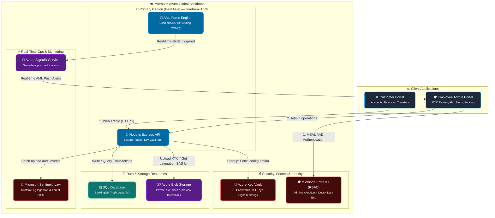

# 🏦 Azure Banking System (Full-Stack & Cloud Infrastructure)

<div align="center">
  
  
  
  
  
  
</div>

<br>

An enterprise-grade, highly secure, and compliant **Full-Stack Banking Application & Cloud Infrastructure** deployed on Microsoft Azure. Designed specifically for financial systems, this project integrates a modern **React Frontend Portal**, a secure **Node.js Express API**, and **Terraform IaC** distributed across multiple geographic regions with strict governance, zero-trust networking, real-time auditing, and fraud detection.

---
video Eplanation:

## 🏗️ System Architecture & Data Flow

This project features a multi-tiered banking architecture mapping customer actions and administrative oversight directly to isolated, highly available Azure resources.



### Core Architecture Components
1. **Frontend Portal (`portal`)**: A React/Vite web application implementing Microsoft MSAL for Entra ID single sign-on, dynamic customer accounts, money transfers, and a rich administrator dashboard displaying real-time AML fraud alerts, document-level KYC verification, and transaction audit trails.
2. **Backend API (`backend`)**: An Express.js Node.js server executing the core banking logic, database operations, and deep integrations with Azure SDKs. It uses System-Assigned Managed Identity (`DefaultAzureCredential`) to securely pull secrets from Azure Key Vault without hardcoded credentials.
3. **Infrastructure as Code (`terraform-banking`)**: Provisions a secure, isolated network topology distributed across two Azure regions (`eastasia` and `southeastasia`) connected via Global VNet Peering, governed by custom Azure Policies, and micro-segmented with Network Security Groups (NSGs).

---

## ✨ System Features

### 🏢 Full-Stack Applications
* **Customer Dashboard**: Open bank accounts, view real-time balances, track transaction histories, and transfer funds securely.
* **Administrative Operations**: A robust console for managing bank operations:
  * **KYC Document Review**: Securely view submitted documents (e.g. Passports, Utility Bills, Selfies). Originals are stored privately in Azure Blob Storage; the backend automatically scales down uploads using `sharp` to build a preview thumbnail cache and signs time-limited User Delegation SAS tokens (e.g. 60-minute expiry) to prevent exposure.
  * **Transactions Monitoring**: Real-time audit view of all banking transactions, including granular searches, flags, and account freezing.
  * **Visual Audit Trail**: Full visibility into internal security, operational, and system audit logs fetched directly from the database.

### 🧠 Security & Intelligence Services
* **AML Fraud Rules Engine**: Automatic, real-time transaction analysis on all transfers:
  * **Large Cash Thresholds**: Triggers high-severity alert on single transactions > $10,000.
  * **Anti-Structuring**: Tracks 24-hour transaction histories to catch patterns just below reporting limits (e.g., outflows between $8,000 and $10,000).
  * **Velocity Anomalies**: Flags rapid-fire velocity (> 5 transactions within an hour).
  * **Geographic Anomaly Engine**: Catches geographic shifts compared to a customer's recent transaction locations.
  * **Auto-Escalation**: Freezes and flags customer accounts automatically upon critical rule trips or multiple accumulated alerts.
* **Real-Time Push alerts**: Uses **Azure SignalR Service** in serverless mode to instantly broadcast AML fraud flags and status updates directly to admin portal browsers.
* **SIEM / Log Analytics Ingestion**: Batches and pushes internal security/audit events to Azure Monitor custom tables (`BankingAuditLogs_CL`) via a Data Collection Endpoint (DCE), fueling **Microsoft Sentinel** security playbooks and analytics.

### 🛡️ Cloud Governance & Network Isolation
* **Zero Trust VNet Architecture**: Core servers are isolated inside private subnets with no public endpoints. Access is facilitated securely through **Azure Bastion** for administration.
* **Strict Azure Policy Compliance**: Custom regulatory guardrails:
  * Restricts resource deployments exclusively to approved regions (`eastasia` and `southeastasia`).
  * Blocks VM creation with public-facing IPs.
  * Mandates a tagging schema (`Owner`, `Environment`, `CostCenter`) for financial and resource accountability.
  * Restricts storage transactions exclusively to HTTPS.
  * Continuous audits to guarantee virtual machines utilize Managed Identities.
* **Granular RBAC Policies**: Segregates duties using Entra ID (Azure AD) Security Groups mapping to scoped roles (Contributor for Bank Admins, Reader for Security Auditors, VM Contributor for App Devs, Storage Blob Data Contributor for Data Engineers).

---

## 📂 Project Structure

```text
📦 Azure banking system
 ┣ 📂 backend                     # Node.js Express Backend API
 ┃ ┣ 📂 src
 ┃ ┃ ┣ 📂 config                  # Secrets & connection managers
 ┃ ┃ ┣ 📂 db                      # Database schema and connections
 ┃ ┃ ┣ 📂 middleware              # Security, validation, and audit middleware
 ┃ ┃ ┣ 📂 routes                  # API routing endpoints (Accounts, KYC, Tx, etc.)
 ┃ ┃ ┣ 📂 services                # Integrations (AML, Blob Storage, SignalR, Sentinel)
 ┃ ┃ ┗ 📜 server.js               # Application bootstrap & initialization
 ┃ ┣ 📜 Dockerfile                # Production API container configuration
 ┃ ┗ 📜 package.json              # Backend dependencies (Azure SDKs, express, sharp)
 ┣ 📂 portal                      # React Vite Frontend Application
 ┃ ┣ 📂 src
 ┃ ┃ ┣ 📂 auth                    # MSAL authentication config & contexts
 ┃ ┃ ┣ 📂 components              # Customer (Accounts, Transfers) & Login views
 ┃ ┃ ┃ ┗ 📂 admin                 # Admin dashboard, Audit logs, KYC review, Alerts
 ┃ ┃ ┣ 📂 services                # Centralized API fetch factories
 ┃ ┃ ┗ 📜 main.jsx                # SPA entry point wrapping MSAL Provider
 ┃ ┣ 📜 Dockerfile                # Nginx React webserver configuration
 ┃ ┗ 📜 package.json              # Frontend dependencies (@azure/msal-react, signalr)
 ┣ 📂 terraform-banking           # Multi-Region Infrastructure as Code
 ┃ ┣ 📂 modules                   # Reusable IaC infrastructure components
 ┃ ┃ ┣ 📂 nsg                     # Security Groups & virtual firewalls
 ┃ ┃ ┣ 📂 storage                 # Secure Storage Accounts
 ┃ ┃ ┣ 📂 subnet                  # Micro-segmented subnet topologies
 ┃ ┃ ┣ 📂 vm                      # Burstable VM instances (B2ats_v2)
 ┃ ┃ ┗ 📂 vnet                    # Virtual Network peerings
 ┃ ┣ 📜 main.tf                   # Primary orchestrator
 ┃ ┣ 📜 main_extended.tf          # Corebank server VM, Bastion, & Firewall routing
 ┃ ┣ 📜 policy.tf                 # Regulatory compliance (Azure Policy)
 ┃ ┣ 📜 rbac.tf                   # Entra ID Security Group roles & assignments
 ┃ ┣ 📜 signalr.tf                # Serverless real-time SignalR service provisioning
 ┃ ┣ 📜 deploy_all.ps1            # Post-Apply automated build & remote deployment script
 ┃ ┣ 📜 variables.tf              # Input parameters
 ┃ ┗ 📜 outputs.tf                # Provisioned endpoint exports
 ┗ 📜 README.md
```

---

## 🚀 Getting Started

### 💻 Local Development Setup

To run and test the frontend and backend locally with mock integrations (fallback to `.env` if Azure services are not available):

#### 1. Setup Backend API
1. Navigate to the backend folder:
   ```bash
   cd backend
   ```
2. Install dependencies:
   ```bash
   npm install
   ```
3. Create a `.env` file based on `.env.example` and set local variables:
   ```ini
   PORT=3001
   NODE_ENV=development
   # Local dev will bypass Key Vault and use .env fallbacks
   ```
4. Run the development server (runs nodemon):
   ```bash
   npm run dev
   ```
   *The API will be available at `http://localhost:3001`*

#### 2. Setup Frontend Portal
1. Navigate to the portal folder:
   ```bash
   cd portal
   ```
2. Install dependencies:
   ```bash
   npm install
   ```
3. Create a `.env` file pointing to your local API:
   ```ini
   VITE_API_URL=http://localhost:3001/api
   ```
4. Start the Vite development server:
   ```bash
   npm run dev
   ```
   *The portal will be available at `http://localhost:5173`*

---

### ☁️ Infrastructure Deployment & Automation

This project features a fully integrated **Post-Apply Automation Trigger** (`terraform_data.auto_deploy`) that builds, compiles, and deploys both applications automatically once Terraform completes!

#### Deployment Steps:

1. **Authenticate with Azure**
   ```powershell
   az login
   az account set --subscription "<YOUR_SUBSCRIPTION_ID>"
   ```

2. **Initialize and Plan Infrastructure**
   ```bash
   cd terraform-banking
   terraform init
   terraform plan
   ```

3. **Apply & Deploy**
   ```bash
   terraform apply
   ```
   *Enter VM Administrator Password when prompted.*

#### What the Post-Apply Automation Script (`deploy_all.ps1`) executes:
1. Dynamically writes the VM's Public IP to the portal's `.env` configuration.
2. Installs npm packages and compiles the React production bundle using Vite.
3. Purges and uploads the React static site to the Storage Account's `$web` hosting container.
4. Executes a remote Azure CLI shell script command on `corebank-1` VM to:
   * Install Node.js 20, Git, and PM2.
   * Clone the banking system repository and install dependencies.
   * Write production `.env` config with Key Vault mappings, SignalR strings, and CORS headers.
   * Start and register the Express API with `PM2` for high reliability and monitoring.

Once completed, the script prints your live application endpoints:
* 🌐 **Static Web Portal**: `https://<STORAGE_ACCOUNT>.z7.web.core.windows.net`
* 🚀 **Core Backend API**: `http://<VM_PUBLIC_IP>:3001`

---

## 🔒 Security Posture & Compliance Summary

### Network Security & Zero-Trust
* **Deny-by-Default Inbound**: NSGs drop all incoming traffic from the `Internet` by default across all VM subnets.
* **Secure Bastion Hosts**: Administrator SSH/RDP access is channeled exclusively via Azure Bastion, leaving zero public management ports exposed.
* **Internal Inter-Region Mesh**: Traffic between East Asia and Southeast Asia flows entirely through an encrypted backbone utilizing Global VNet Peering.

### Azure Active Directory RBAC Departmental Structure
1. 🛡️ **IT Operations (Bank Administrators)** - Granted `Contributor`. Manages cloud topologies but cannot adjust global security policies.
2. 🔎 **Risk & Audit (Security Auditors)** - Granted `Reader`. Has full visibility into metrics, logs, and compliance, but cannot mutate resources or read secrets.
3. 💻 **Application Engineering (Application Developers)** - Granted `Virtual Machine Contributor`. Manages application and compute lifecycles.
4. 💾 **Data & Analytics (Data Engineers)** - Granted `Storage Blob Data Contributor`. Scoped exclusively to log storage and diagnostic data pools.
